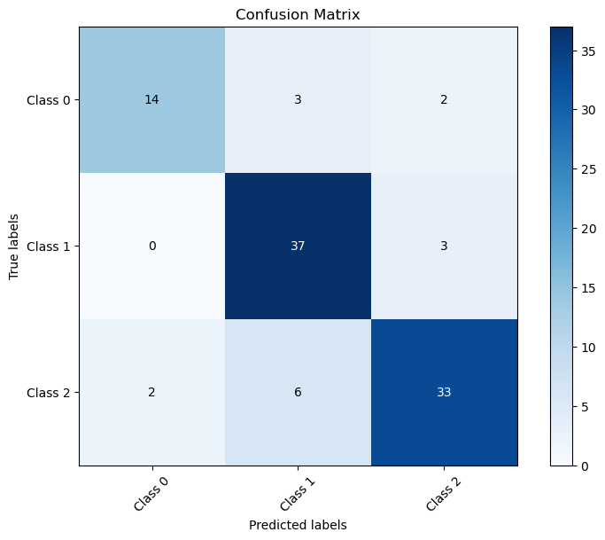
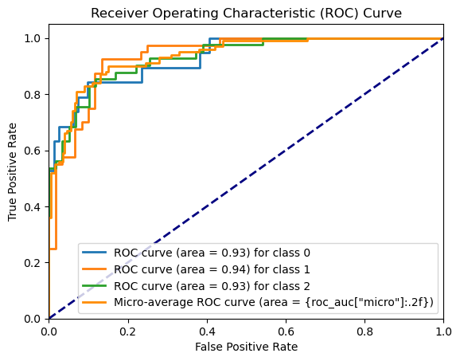
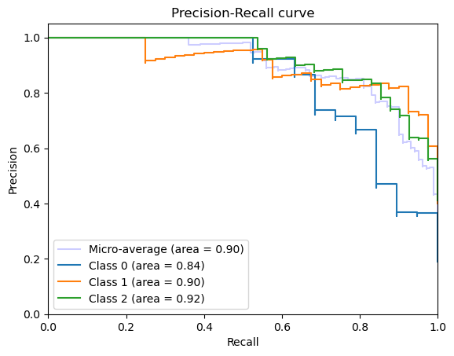

```python
from gensim.models import Word2Vec
from transformers import BertTokenizer, BertModel
from sklearn.model_selection import train_test_split
from sklearn.linear_model import LogisticRegression
from sklearn.ensemble import StackingClassifier
from sklearn.metrics import accuracy_score
from nltk.tokenize import word_tokenize
from nltk.corpus import stopwords
from nltk.stem import WordNetLemmatizer
import torch
import re
import numpy as np
import pandas as pd

# Example dataset (replace with your data)
df = pd.read_csv('final_data.csv')

# Initialize NLTK's WordNetLemmatizer
lemmatizer = WordNetLemmatizer()
st_wo = set(stopwords.words('english'))
# Define a function for preprocessing with lemmatization
def preprocess(desc):
    desc = str(desc).lower() 
    desc = re.sub(r'\d+', '', desc) 
    desc = re.sub(r'[^\w\s]', '', desc) 

    # Tokenize the text
    tokens = word_tokenize(desc)

    # Lemmatize each token and join them back into a sentence
    lemmatized_text = ' '.join([lemmatizer.lemmatize(token) for token in tokens])

    desc = " ".join([w for w in lemmatized_text.split() if not w in st_wo]) 
    return desc

df['description'] = df['description'].apply(preprocess)
#df['issue_title'] = df['issue_title'].apply(preprocess)

# Combine text from "description" and "issue_title" columns
#df['combined_text'] = df['description'] + ' ' + df['issue_title']

corpus = df['description'].tolist()
labels = df['Bug'].tolist()
```


```python
df.to_csv('preprocessed_data_desc.csv',index=False)
```


```python
# Load pre-trained BERT model and tokenizer
from transformers import BertTokenizer, BertModel
tokenizer = BertTokenizer.from_pretrained('bert-base-uncased')
bert_model = BertModel.from_pretrained('bert-base-uncased')
```


```python
# Encode the text using BERT and create embeddings
bert_embeddings = []

for text in corpus:
    input_ids = tokenizer(text, return_tensors="pt", padding=True, truncation=True)
    with torch.no_grad():
        outputs = bert_model(**input_ids)
    
    cls_embedding = outputs.last_hidden_state.mean(dim=1).numpy()
    bert_embeddings.append(cls_embedding)
    print("Bert Embeddings:",len(bert_embeddings))
```

    Bert Embeddings: 1
    Bert Embeddings: 2
    Bert Embeddings: 3
    Bert Embeddings: 4
    Bert Embeddings: 5
    Bert Embeddings: 6
    Bert Embeddings: 7
    Bert Embeddings: 8
    Bert Embeddings: 9
    Bert Embeddings: 10
    Bert Embeddings: 11
    Bert Embeddings: 12
    Bert Embeddings: 13
    Bert Embeddings: 14
    Bert Embeddings: 15
    Bert Embeddings: 16
    Bert Embeddings: 17
    Bert Embeddings: 18
    Bert Embeddings: 19
    Bert Embeddings: 20
    Bert Embeddings: 21
    Bert Embeddings: 22
    Bert Embeddings: 23
    Bert Embeddings: 24
    Bert Embeddings: 25
    Bert Embeddings: 26
    Bert Embeddings: 27
    Bert Embeddings: 28
    Bert Embeddings: 29
    Bert Embeddings: 30
    Bert Embeddings: 31
    Bert Embeddings: 32
    Bert Embeddings: 33
    Bert Embeddings: 34
    Bert Embeddings: 35
    Bert Embeddings: 36
    Bert Embeddings: 37
    Bert Embeddings: 38
    Bert Embeddings: 39
    Bert Embeddings: 40
    Bert Embeddings: 41
    Bert Embeddings: 42
    Bert Embeddings: 43
    Bert Embeddings: 44
    Bert Embeddings: 45
    Bert Embeddings: 46
    Bert Embeddings: 47
    Bert Embeddings: 48
    Bert Embeddings: 49
    Bert Embeddings: 50
    Bert Embeddings: 51
    Bert Embeddings: 52
    Bert Embeddings: 53
    Bert Embeddings: 54
    Bert Embeddings: 55
    Bert Embeddings: 56
    Bert Embeddings: 57
    Bert Embeddings: 58
    Bert Embeddings: 59
    Bert Embeddings: 60
    Bert Embeddings: 61
    Bert Embeddings: 62
    Bert Embeddings: 63
    Bert Embeddings: 64
    Bert Embeddings: 65
    Bert Embeddings: 66
    Bert Embeddings: 67
    Bert Embeddings: 68
    Bert Embeddings: 69
    Bert Embeddings: 70
    Bert Embeddings: 71
    Bert Embeddings: 72
    Bert Embeddings: 73
    Bert Embeddings: 74
    Bert Embeddings: 75
    Bert Embeddings: 76
    Bert Embeddings: 77
    Bert Embeddings: 78
    Bert Embeddings: 79
    Bert Embeddings: 80
    Bert Embeddings: 81
    Bert Embeddings: 82
    Bert Embeddings: 83
    Bert Embeddings: 84
    Bert Embeddings: 85
    Bert Embeddings: 86
    Bert Embeddings: 87
    Bert Embeddings: 88
    Bert Embeddings: 89
    Bert Embeddings: 90
    Bert Embeddings: 91
    Bert Embeddings: 92
    Bert Embeddings: 93
    Bert Embeddings: 94
    Bert Embeddings: 95
    Bert Embeddings: 96
    Bert Embeddings: 97
    Bert Embeddings: 98
    Bert Embeddings: 99
    Bert Embeddings: 100
    Bert Embeddings: 101
    Bert Embeddings: 102
    Bert Embeddings: 103
    Bert Embeddings: 104
    Bert Embeddings: 105
    Bert Embeddings: 106
    Bert Embeddings: 107
    Bert Embeddings: 108
    Bert Embeddings: 109
    Bert Embeddings: 110
    Bert Embeddings: 111
    Bert Embeddings: 112
    Bert Embeddings: 113
    Bert Embeddings: 114
    Bert Embeddings: 115
    Bert Embeddings: 116
    Bert Embeddings: 117
    Bert Embeddings: 118
    Bert Embeddings: 119
    Bert Embeddings: 120
    Bert Embeddings: 121
    Bert Embeddings: 122
    Bert Embeddings: 123
    Bert Embeddings: 124
    Bert Embeddings: 125
    Bert Embeddings: 126
    Bert Embeddings: 127
    Bert Embeddings: 128
    Bert Embeddings: 129
    Bert Embeddings: 130
    Bert Embeddings: 131
    Bert Embeddings: 132
    Bert Embeddings: 133
    Bert Embeddings: 134
    Bert Embeddings: 135
    Bert Embeddings: 136
    Bert Embeddings: 137
    Bert Embeddings: 138
    Bert Embeddings: 139
    Bert Embeddings: 140
    Bert Embeddings: 141
    Bert Embeddings: 142
    Bert Embeddings: 143
    Bert Embeddings: 144
    Bert Embeddings: 145
    Bert Embeddings: 146
    Bert Embeddings: 147
    Bert Embeddings: 148
    Bert Embeddings: 149
    Bert Embeddings: 150
    Bert Embeddings: 151
    Bert Embeddings: 152
    Bert Embeddings: 153
    Bert Embeddings: 154
    Bert Embeddings: 155
    Bert Embeddings: 156
    Bert Embeddings: 157
    Bert Embeddings: 158
    Bert Embeddings: 159
    Bert Embeddings: 160
    Bert Embeddings: 161
    Bert Embeddings: 162
    Bert Embeddings: 163
    Bert Embeddings: 164
    Bert Embeddings: 165
    Bert Embeddings: 166
    Bert Embeddings: 167
    Bert Embeddings: 168
    Bert Embeddings: 169
    Bert Embeddings: 170
    Bert Embeddings: 171
    Bert Embeddings: 172
    Bert Embeddings: 173
    Bert Embeddings: 174
    Bert Embeddings: 175
    Bert Embeddings: 176
    Bert Embeddings: 177
    Bert Embeddings: 178
    Bert Embeddings: 179
    Bert Embeddings: 180
    Bert Embeddings: 181
    Bert Embeddings: 182
    Bert Embeddings: 183
    Bert Embeddings: 184
    Bert Embeddings: 185
    Bert Embeddings: 186
    Bert Embeddings: 187
    Bert Embeddings: 188
    Bert Embeddings: 189
    Bert Embeddings: 190
    Bert Embeddings: 191
    Bert Embeddings: 192
    Bert Embeddings: 193
    Bert Embeddings: 194
    Bert Embeddings: 195
    Bert Embeddings: 196
    Bert Embeddings: 197
    Bert Embeddings: 198
    Bert Embeddings: 199
    Bert Embeddings: 200
    Bert Embeddings: 201
    Bert Embeddings: 202
    Bert Embeddings: 203
    Bert Embeddings: 204
    Bert Embeddings: 205
    Bert Embeddings: 206
    Bert Embeddings: 207
    Bert Embeddings: 208
    Bert Embeddings: 209
    Bert Embeddings: 210
    Bert Embeddings: 211
    Bert Embeddings: 212
    Bert Embeddings: 213
    Bert Embeddings: 214
    Bert Embeddings: 215
    Bert Embeddings: 216
    Bert Embeddings: 217
    Bert Embeddings: 218
    Bert Embeddings: 219
    Bert Embeddings: 220
    Bert Embeddings: 221
    Bert Embeddings: 222
    Bert Embeddings: 223
    Bert Embeddings: 224
    Bert Embeddings: 225
    Bert Embeddings: 226
    Bert Embeddings: 227
    Bert Embeddings: 228
    Bert Embeddings: 229
    Bert Embeddings: 230
    Bert Embeddings: 231
    Bert Embeddings: 232
    Bert Embeddings: 233
    Bert Embeddings: 234
    Bert Embeddings: 235
    Bert Embeddings: 236
    Bert Embeddings: 237
    Bert Embeddings: 238
    Bert Embeddings: 239
    Bert Embeddings: 240
    Bert Embeddings: 241
    Bert Embeddings: 242
    Bert Embeddings: 243
    Bert Embeddings: 244
    Bert Embeddings: 245
    Bert Embeddings: 246
    Bert Embeddings: 247
    Bert Embeddings: 248
    Bert Embeddings: 249
    Bert Embeddings: 250
    Bert Embeddings: 251
    Bert Embeddings: 252
    Bert Embeddings: 253
    Bert Embeddings: 254
    Bert Embeddings: 255
    Bert Embeddings: 256
    Bert Embeddings: 257
    Bert Embeddings: 258
    Bert Embeddings: 259
    Bert Embeddings: 260
    Bert Embeddings: 261
    Bert Embeddings: 262
    Bert Embeddings: 263
    Bert Embeddings: 264
    Bert Embeddings: 265
    Bert Embeddings: 266
    Bert Embeddings: 267
    Bert Embeddings: 268
    Bert Embeddings: 269
    Bert Embeddings: 270
    Bert Embeddings: 271
    Bert Embeddings: 272
    Bert Embeddings: 273
    Bert Embeddings: 274
    Bert Embeddings: 275
    Bert Embeddings: 276
    Bert Embeddings: 277
    Bert Embeddings: 278
    Bert Embeddings: 279
    Bert Embeddings: 280
    Bert Embeddings: 281
    Bert Embeddings: 282
    Bert Embeddings: 283
    Bert Embeddings: 284
    Bert Embeddings: 285
    Bert Embeddings: 286
    Bert Embeddings: 287
    Bert Embeddings: 288
    Bert Embeddings: 289
    Bert Embeddings: 290
    Bert Embeddings: 291
    Bert Embeddings: 292
    Bert Embeddings: 293
    Bert Embeddings: 294
    Bert Embeddings: 295
    Bert Embeddings: 296
    Bert Embeddings: 297
    Bert Embeddings: 298
    Bert Embeddings: 299
    Bert Embeddings: 300
    Bert Embeddings: 301
    Bert Embeddings: 302
    Bert Embeddings: 303
    Bert Embeddings: 304
    Bert Embeddings: 305
    Bert Embeddings: 306
    Bert Embeddings: 307
    Bert Embeddings: 308
    Bert Embeddings: 309
    Bert Embeddings: 310
    Bert Embeddings: 311
    Bert Embeddings: 312
    Bert Embeddings: 313
    Bert Embeddings: 314
    Bert Embeddings: 315
    Bert Embeddings: 316
    Bert Embeddings: 317
    Bert Embeddings: 318
    Bert Embeddings: 319
    Bert Embeddings: 320
    Bert Embeddings: 321
    Bert Embeddings: 322
    Bert Embeddings: 323
    Bert Embeddings: 324
    Bert Embeddings: 325
    Bert Embeddings: 326
    Bert Embeddings: 327
    Bert Embeddings: 328
    Bert Embeddings: 329
    Bert Embeddings: 330
    Bert Embeddings: 331
    Bert Embeddings: 332
    Bert Embeddings: 333
    Bert Embeddings: 334
    Bert Embeddings: 335
    Bert Embeddings: 336
    Bert Embeddings: 337
    Bert Embeddings: 338
    Bert Embeddings: 339
    Bert Embeddings: 340
    Bert Embeddings: 341
    Bert Embeddings: 342
    Bert Embeddings: 343
    Bert Embeddings: 344
    Bert Embeddings: 345
    Bert Embeddings: 346
    Bert Embeddings: 347
    Bert Embeddings: 348
    Bert Embeddings: 349
    Bert Embeddings: 350
    Bert Embeddings: 351
    Bert Embeddings: 352
    Bert Embeddings: 353
    Bert Embeddings: 354
    Bert Embeddings: 355
    Bert Embeddings: 356
    Bert Embeddings: 357
    Bert Embeddings: 358
    Bert Embeddings: 359
    Bert Embeddings: 360
    Bert Embeddings: 361
    Bert Embeddings: 362
    Bert Embeddings: 363
    Bert Embeddings: 364
    Bert Embeddings: 365
    Bert Embeddings: 366
    Bert Embeddings: 367
    Bert Embeddings: 368
    Bert Embeddings: 369
    Bert Embeddings: 370
    Bert Embeddings: 371
    Bert Embeddings: 372
    Bert Embeddings: 373
    Bert Embeddings: 374
    Bert Embeddings: 375
    Bert Embeddings: 376
    Bert Embeddings: 377
    Bert Embeddings: 378
    Bert Embeddings: 379
    Bert Embeddings: 380
    Bert Embeddings: 381
    Bert Embeddings: 382
    Bert Embeddings: 383
    Bert Embeddings: 384
    Bert Embeddings: 385
    Bert Embeddings: 386
    Bert Embeddings: 387
    Bert Embeddings: 388
    Bert Embeddings: 389
    Bert Embeddings: 390
    Bert Embeddings: 391
    Bert Embeddings: 392
    Bert Embeddings: 393
    Bert Embeddings: 394
    Bert Embeddings: 395
    Bert Embeddings: 396
    Bert Embeddings: 397
    Bert Embeddings: 398
    Bert Embeddings: 399
    Bert Embeddings: 400
    Bert Embeddings: 401
    Bert Embeddings: 402
    Bert Embeddings: 403
    Bert Embeddings: 404
    Bert Embeddings: 405
    Bert Embeddings: 406
    Bert Embeddings: 407
    Bert Embeddings: 408
    Bert Embeddings: 409
    Bert Embeddings: 410
    Bert Embeddings: 411
    Bert Embeddings: 412
    Bert Embeddings: 413
    Bert Embeddings: 414
    Bert Embeddings: 415
    Bert Embeddings: 416
    Bert Embeddings: 417
    Bert Embeddings: 418
    Bert Embeddings: 419
    Bert Embeddings: 420
    Bert Embeddings: 421
    Bert Embeddings: 422
    Bert Embeddings: 423
    Bert Embeddings: 424
    Bert Embeddings: 425
    Bert Embeddings: 426
    Bert Embeddings: 427
    Bert Embeddings: 428
    Bert Embeddings: 429
    Bert Embeddings: 430
    Bert Embeddings: 431
    Bert Embeddings: 432
    Bert Embeddings: 433
    Bert Embeddings: 434
    Bert Embeddings: 435
    Bert Embeddings: 436
    Bert Embeddings: 437
    Bert Embeddings: 438
    Bert Embeddings: 439
    Bert Embeddings: 440
    Bert Embeddings: 441
    Bert Embeddings: 442
    Bert Embeddings: 443
    Bert Embeddings: 444
    Bert Embeddings: 445
    Bert Embeddings: 446
    Bert Embeddings: 447
    Bert Embeddings: 448
    Bert Embeddings: 449
    Bert Embeddings: 450
    Bert Embeddings: 451
    Bert Embeddings: 452
    Bert Embeddings: 453
    Bert Embeddings: 454
    Bert Embeddings: 455
    Bert Embeddings: 456
    Bert Embeddings: 457
    Bert Embeddings: 458
    Bert Embeddings: 459
    Bert Embeddings: 460
    Bert Embeddings: 461
    Bert Embeddings: 462
    Bert Embeddings: 463
    Bert Embeddings: 464
    Bert Embeddings: 465
    Bert Embeddings: 466
    Bert Embeddings: 467
    Bert Embeddings: 468
    Bert Embeddings: 469
    Bert Embeddings: 470
    Bert Embeddings: 471
    Bert Embeddings: 472
    Bert Embeddings: 473
    Bert Embeddings: 474
    Bert Embeddings: 475
    Bert Embeddings: 476
    Bert Embeddings: 477
    Bert Embeddings: 478
    Bert Embeddings: 479
    Bert Embeddings: 480
    Bert Embeddings: 481
    Bert Embeddings: 482
    Bert Embeddings: 483
    Bert Embeddings: 484
    Bert Embeddings: 485
    Bert Embeddings: 486
    Bert Embeddings: 487
    Bert Embeddings: 488
    Bert Embeddings: 489
    Bert Embeddings: 490
    Bert Embeddings: 491
    Bert Embeddings: 492
    Bert Embeddings: 493
    Bert Embeddings: 494
    Bert Embeddings: 495
    Bert Embeddings: 496
    Bert Embeddings: 497
    Bert Embeddings: 498
    Bert Embeddings: 499
    Bert Embeddings: 500
    


```python
bert_embeddings = np.vstack(bert_embeddings)
```


```python
df_embeds=pd.DataFrame(bert_embeddings)
df_embeds.to_csv('CSV_embeddings_desc.csv', index=False)
np.save('Nump_embeddings_desc.npy',bert_embeddings)
```


```python
import numpy as np
bert_embeddings=np.load('Nump_embeddings_desc.npy')
```


```python
bert_embeddings = np.vstack(bert_embeddings)
```


```python
import pandas as pd
from sklearn.model_selection import train_test_split
from sklearn.linear_model import LogisticRegression
from sklearn.ensemble import StackingClassifier
from sklearn.metrics import accuracy_score
from sklearn.ensemble import StackingClassifier, RandomForestClassifier, GradientBoostingClassifier
from sklearn.svm import SVC
df = pd.read_csv('final_data.csv')
labels = df['Bug'].tolist()
from sklearn.preprocessing import LabelEncoder
label_encoder = LabelEncoder()

# Fit and transform the class labels
encoded_labels = label_encoder.fit_transform(labels)

# Print the encoded labels
print("Encoded Labels:", len(encoded_labels))
```

    Encoded Labels: 500
    


```python
X_train, X_test, y_train, y_test = train_test_split(bert_embeddings, encoded_labels, test_size=0.2, random_state=25)
base_classifiers = [
       ('random_forest', RandomForestClassifier(n_estimators=100, random_state=25)),
       ('gradient_boosting', GradientBoostingClassifier(n_estimators=100, random_state=25)),
       ('svm', SVC(kernel='rbf',decision_function_shape='ovr', probability=True))
]
meta_classifier = LogisticRegression(max_iter=1000)
stacking_classifier = StackingClassifier(estimators=base_classifiers, final_estimator=meta_classifier)
stacking_classifier.fit(X_train, y_train)
y_pred = stacking_classifier.predict(X_test)
accuracy = accuracy_score(y_test, y_pred)
#print(i,'Accuracy:',accuracy*100)
```


```python
print("Accuracy:", accuracy*100)
```

    Accuracy: 84.0
    


```python

```


```python

```


```python
from sklearn.metrics import classification_report
print(classification_report(y_test,y_pred))
```

                  precision    recall  f1-score   support
    
               0       0.88      0.74      0.80        19
               1       0.80      0.93      0.86        40
               2       0.87      0.80      0.84        41
    
        accuracy                           0.84       100
       macro avg       0.85      0.82      0.83       100
    weighted avg       0.84      0.84      0.84       100
    
    


```python
import numpy as np
from sklearn.metrics import confusion_matrix
import matplotlib.pyplot as plt
y_true_conf=y_test
# Create a confusion matrix
cm = confusion_matrix(y_true_conf, y_pred)

# Visualize the confusion matrix
plt.figure(figsize=(8, 6))
plt.imshow(cm, interpolation='nearest', cmap=plt.cm.Blues)
plt.title('Confusion Matrix')
plt.colorbar()

# Set axis labels
classes = ['Class 0', 'Class 1', 'Class 2']
tick_marks = np.arange(len(classes))
plt.xticks(tick_marks, classes, rotation=45)
plt.yticks(tick_marks, classes)

# Display values in the cells
thresh = cm.max() / 2.
for i in range(len(classes)):
    for j in range(len(classes)):
        plt.text(j, i, format(cm[i, j], 'd'),
                 ha="center", va="center",
                 color="white" if cm[i, j] > thresh else "black")

plt.tight_layout()
plt.ylabel('True labels')
plt.xlabel('Predicted labels')
plt.show()

```


    

    


```python
y_prob = stacking_classifier.predict_proba(X_test)
```


```python
import numpy as np
import matplotlib.pyplot as plt
from sklearn.metrics import roc_curve, auc
from sklearn.preprocessing import label_binarize
from sklearn.metrics import roc_auc_score

# Replace 'y_true' with your true labels and 'y_score' with predicted scores or probabilities
y_score = y_prob

# For multi-class classification, binarize the labels
y_true_roc = label_binarize(y_test, classes=[0, 1, 2])  # Adjust the number of classes as needed

# Compute ROC curve and ROC area for each class
fpr = dict()
tpr = dict()
roc_auc = dict()
n_classes=3
for i in range(n_classes):  # Replace 'n_classes' with the actual number of classes
    fpr[i], tpr[i], _ = roc_curve(y_true_roc[:, i], y_score[:, i])
    roc_auc[i] = auc(fpr[i], tpr[i])

# Compute micro-average ROC curve and ROC AUC
fpr["micro"], tpr["micro"], _ = roc_curve(y_true_roc.ravel(), y_score.ravel())
roc_auc["micro"] = auc(fpr["micro"], tpr["micro"])

# Plot ROC curve
plt.figure()
lw = 2

# Plot the ROC curve for each class
for i in range(n_classes):  # Replace 'n_classes' with the actual number of classes
    plt.plot(fpr[i], tpr[i], lw=lw, label=f'ROC curve (area = {roc_auc[i]:.2f}) for class {i}')

# Plot the micro-average ROC curve
plt.plot(fpr["micro"], tpr["micro"], color='darkorange', lw=lw, label='Micro-average ROC curve (area = {roc_auc["micro"]:.2f})')

plt.plot([0, 1], [0, 1], color='navy', lw=lw, linestyle='--')
plt.xlim([0.0, 1.0])
plt.ylim([0.0, 1.05])
plt.xlabel('False Positive Rate')
plt.ylabel('True Positive Rate')
plt.title('Receiver Operating Characteristic (ROC) Curve')
plt.legend(loc='lower right')
plt.show()

```


    

    


```python
import matplotlib.pyplot as plt
from sklearn.metrics import precision_recall_curve, average_precision_score

# Assuming you have computed the predicted probabilities for each class
# The y_scores should be a 2D array where each column corresponds to a class
y_true_prec=label_binarize(y_test, classes=[0, 1, 2])
y_scores=y_prob
# Calculate the precision-recall curve for each class
precision = dict()
recall = dict()
average_precision = dict()

# Loop over each class (assuming y_scores is a 2D array)
for i in range(n_classes):
    precision[i], recall[i], _ = precision_recall_curve(y_true_prec[:, i], y_scores[:, i])
    average_precision[i] = average_precision_score(y_true_prec[:, i], y_scores[:, i])

# Compute micro-average precision-recall curve and average precision
precision["micro"], recall["micro"], _ = precision_recall_curve(y_true_prec.ravel(), y_scores.ravel())
average_precision["micro"] = average_precision_score(y_true_prec, y_scores, average="micro")

# Plot the precision-recall curve for each class
plt.figure()
plt.step(recall['micro'], precision['micro'], where='post', color='b', alpha=0.2, label='Micro-average (area = {0:0.2f})'.format(average_precision['micro']))

for i in range(n_classes):
    plt.step(recall[i], precision[i], where='post', label='Class {0} (area = {1:0.2f})'.format(i, average_precision[i]))

plt.xlabel('Recall')
plt.ylabel('Precision')
plt.ylim([0.0, 1.05])
plt.xlim([0.0, 1.0])
plt.title('Precision-Recall curve')
plt.legend(loc='lower left')
plt.show()

```


    

    


```python
import joblib
```


```python
joblib.dump(stacking_classifier,"stacking_model.joblib")
```


    ['stacking_model.joblib']


```python
import tkinter as tk
import joblib
import torch
from transformers import BertTokenizer, BertModel
from sklearn.ensemble import StackingClassifier
from sklearn.linear_model import LogisticRegression
import numpy as np

# Load the Stacking Classifier model
stacking_model = joblib.load('stacking_model.joblib')

# Load the BERT tokenizer
bert_tokenizer = BertTokenizer.from_pretrained('bert-base-uncased')

# Load the BERT model (you can replace 'bert_model.pth' with the actual path)
bert_model = BertModel.from_pretrained('bert-base-uncased')
# bert_model.load_state_dict(torch.load('bert_model.pth'))
# bert_model.eval()

def classify():
    try:
        description = entry1.get()

        # Tokenize the input using the BERT tokenizer
        inputs = bert_tokenizer(description, return_tensors='pt', padding=True, truncation=True)
        
        # Generate BERT embeddings
        with torch.no_grad():
            outputs = bert_model(**inputs)
        cls_embedding = outputs.last_hidden_state.mean(dim=1).numpy()

        # Classify using the Stacking Classifier
        y_pred = stacking_model.predict(cls_embedding)
        
        if y_pred == 0:
            y_pred = "Concurrency"
        elif y_pred == 1:
            y_pred = "Memory"
        elif y_pred == 2:
            y_pred = "Semantic"

        # Display the predicted class in the result label
        result_label.config(text=f"Prediction: {y_pred}")

    except ValueError as e:
        result_label.config(text="Invalid input")

# Create the main window and set its properties
root = tk.Tk()
root.title("Bug Classification System")
root.geometry("450x300")

# Create the big label for Bug Classification System
big_label = tk.Label(root, text="Bug Classification System", font=('Helvetica', 16, 'bold'), fg='black')
big_label.grid(row=0, column=0, columnspan=2, pady=5)

# Configure columns and rows for centering
root.columnconfigure(0, weight=1)
root.columnconfigure(1, weight=1)
root.rowconfigure(0, weight=1)
root.rowconfigure(1, weight=1)
root.rowconfigure(3, weight=1)

# Create the input fields and labels
label1 = tk.Label(root, text="Description:", font=('Helvetica', 10, 'bold'))
label1.grid(row=1, column=0, padx=10, pady=5, sticky='e')  # Adjusted alignment to right (east)
entry1 = tk.Entry(root)
entry1.grid(row=1, column=1, padx=10, pady=5, sticky='w')  # Adjusted alignment to left (west)

# Create the button and result label
button = tk.Button(root, text="Classify", command=classify,font=('Helvetica', 10, 'bold'))
button.grid(row=3, column=0, columnspan=2, pady=10)

result_label = tk.Label(root, text="Prediction: ",font=('Helvetica', 10, 'bold'))
result_label.grid(row=4, column=0, columnspan=2, padx=10, pady=10)

# Start the GUI event loop
root.mainloop()

```


```python

```


```python

```


```python

```


```python

```


```python

```
