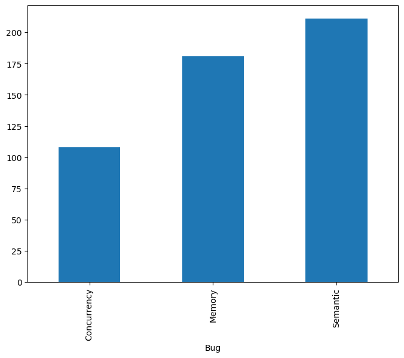
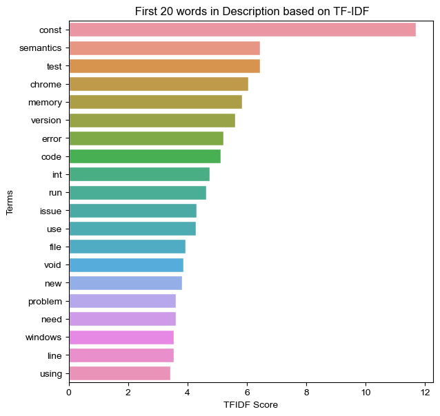
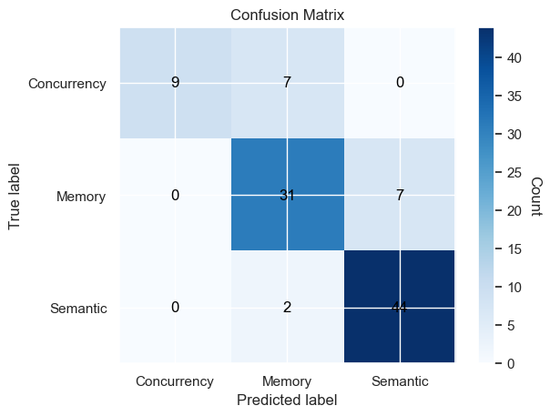
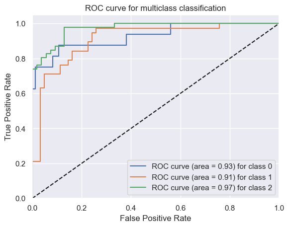
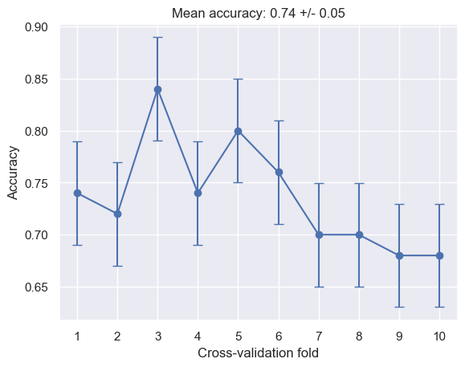

```python

import pandas as pd
import numpy as np
from sklearn.feature_extraction.text import TfidfVectorizer
from sklearn.model_selection import train_test_split
import re
import nltk
from nltk.corpus import stopwords
from sklearn.feature_extraction.text import CountVectorizer
import re
import seaborn as sb
import matplotlib.pyplot as pt
df = pd.read_csv('final_data.csv')

vect = TfidfVectorizer()
st_wo = set(stopwords.words('english'))
def preprocess(desc):
    desc = str(desc).lower() 
    desc = re.sub(r'\d+', '', desc) 
    desc = re.sub(r'[^\w\s]', '', desc) 
    desc = " ".join([w for w in desc.split() if not w in st_wo]) 
    return desc
df['description'] = df['description'].apply(preprocess)
print(df.shape)
```

    (500, 113)
    


```python
df.to_csv('modified_dataset.csv', index=False)
```


```python
figure = pt.figure(figsize=(8,6))
df.groupby('Bug').description.count().plot.bar(ylim=0)
pt.show()
```


    

    


```python
tf1 = TfidfVectorizer(stop_words='english',ngram_range=(1,2))
vect1 = tf1.fit(df.description)
new_desc = vect1.transform(df.description)
features = tf1.get_feature_names_out()
print(len(features))
#TF(t, d) = (Number of times term t appears in document d) / (Total number of terms in document d)
#IDF(t, D) = log_e(Total number of documents in the corpus / Number of documents in which term t appears)
#TF-IDF(t, d, D) = TF(t, d) * IDF(t, D)
```

    34973
    


```python

def tf_score(features):
    terms_dict = {} 
    for t_index, term in enumerate(features):
        t_name = features[t_index]
        terms_dict[t_name] = np.sum(new_desc.T[t_index].toarray())
        
    return terms_dict
terms_dict = tf_score(features)
```


```python

def sort_tf_score(terms_dict):
    sortInd = np.argsort( list(terms_dict.values()))[::-1]
    tName = np.array(list(terms_dict.keys()))
    score = np.array(list(terms_dict.values()))
    tName = tName[sortInd]
    score = score[sortInd]
    
    return tName, score
tName, score = sort_tf_score(terms_dict)
print(tName,score)
```

    ['const' 'semantics' 'test' ... 'directoriesfor profiles'
     'notification received' 'rootinfodrive_file_sync_servicecc notification'] [1.16926011e+01 6.44425874e+00 6.44049143e+00 ... 5.62182446e-03
     5.62182446e-03 5.62182446e-03]
    


```python
def plottings(score,termName, num_wo = 20):

    figure = pt.figure(figsize = (15, 15))
    
    override = {'fontsize': 'large'}

    figure.add_subplot(221)
    sb.set()
    sb.barplot(x = score[:num_wo], y = termName[:num_wo]);
    pt.title(" First 20 words in Description based on TF-IDF".format(num_wo));
    pt.xlabel("TFIDF Score")
    pt.ylabel("Terms")
plottings(score, tName, num_wo = 20)
```


    

    


```python
from sklearn.preprocessing import LabelEncoder
le = LabelEncoder()
df["Bug"] = le.fit_transform(df["Bug"])
print(df['Bug'])
```

    0      0
    1      0
    2      0
    3      0
    4      0
          ..
    495    1
    496    1
    497    1
    498    1
    499    1
    Name: Bug, Length: 500, dtype: int32
    


```python
st_wo=stopwords.words('english')
l_wo=list()
for i in range(0,3,1):
    l_wo.append(list())
for i in range(0,df.shape[0],1):
    for word in df.issue_title[i].split():
        if word not in st_wo:
            l_wo[df["Bug"][i]].append(word)
```


```python
wo_lt=list()
for i in range(0,3,1):
    wo_lt.append(list())
from collections import Counter 
for i in range(0,3,1):
    Ct = Counter(l_wo[i]) 
    recent = Ct.most_common(10) 
    for e in recent:
        wo_lt[i].append(e[0])
print(wo_lt) 

```

    [['concurrency', 'sync', 'races', 'due', 'Sync', 'Sync:', 'Localtime_r', 'result', 'use', 'static'], ['memory', 'Memory', 'leaks', 'leak', 'fails', 'Windows', 'corruption', 'failing', 'Leak', 'tests'], ['semantics', 'support', 'Add', 'Implement', 'attribute', '-', 'shill:', 'mode', 'Remove', 'documentation']]
    


```python
cat_co={i:0 for i in set(df['Bug'])}
for c in df['Bug']:
    cat_co[c]+=1
print(cat_co)
```

    {0: 108, 1: 181, 2: 211}
    


```python
x = vect1.fit_transform(df['description'])
y = df['Bug']
from sklearn.svm import SVC
from time import time
from sklearn.metrics import confusion_matrix,accuracy_score,classification_report
xtr, xte, ytr, yte = train_test_split(x, y, test_size=0.2, random_state=3)
clas=SVC(kernel='linear',random_state=3)
in_time=time()
clas=clas.fit(xtr,ytr)
train_t=time()-in_time
print("Training Time: %fs"%train_t)
new_t=time()
pred=clas.predict(xte)
pred_t=time()-new_t
print("Prediction Time: %fs"%pred_t)
accu=accuracy_score(yte, pred)
print ("Accuracy Score of Linear SVM Classifier: %f"%accu)
cm=confusion_matrix(yte,pred)
print("Confusion Matrix:\n",cm)
print("Classification Report:\n",classification_report(yte,pred))
print("Classified data:")
```

    Training Time: 0.153199s
    Prediction Time: 0.029007s
    Accuracy Score of Linear SVM Classifier: 0.840000
    Confusion Matrix:
     [[ 9  7  0]
     [ 0 31  7]
     [ 0  2 44]]
    Classification Report:
                   precision    recall  f1-score   support
    
               0       1.00      0.56      0.72        16
               1       0.78      0.82      0.79        38
               2       0.86      0.96      0.91        46
    
        accuracy                           0.84       100
       macro avg       0.88      0.78      0.81       100
    weighted avg       0.85      0.84      0.83       100
    
    Classified data:
    


```python
print(clas.decision_function_shape)
```

    ovr
    


```python
class_labels = ['Concurrency', 'Memory', 'Semantic']

# Plot confusion matrix
fig, ax = pt.subplots()
im = ax.imshow(cm, cmap='Blues')

# Create colorbar
cbar = ax.figure.colorbar(im, ax=ax)

# Set colorbar label
cbar.ax.set_ylabel('Count', rotation=-90, va='bottom')

# Set x and y axis labels
ax.set_xticks(np.arange(len(class_labels)))
ax.set_yticks(np.arange(len(class_labels)))
ax.set_xticklabels(class_labels)
ax.set_yticklabels(class_labels)

# Loop over data dimensions and create text annotations
for i in range(len(class_labels)):
    for j in range(len(class_labels)):
        text = ax.text(j, i, cm[i, j], ha='center', va='center', color='black')

# Set title and labels
ax.set_title('Confusion Matrix')
ax.set_xlabel('Predicted label')
ax.set_ylabel('True label')

# Display the plot
pt.show()
```


    

    


```python
import joblib
```


```python
joblib.dump(clas,"svm_model.joblib")

```


    ['svm_model.joblib']


```python
import tkinter as tk
import joblib

# Load the trained vectorizer and SVM model
#vect1 = joblib.load('vectorizer.joblib')
loaded_model = joblib.load('svm_model.joblib')

def classify():
    try:
        description = entry1.get()
        print([description])
        # Vectorize the input using the trained vectorizer
        X = tf1.transform([description])
        #print(tf1)
        #print(X)
        # Classify the input features using the loaded SVM model
        y_pred = loaded_model.predict(X)
        print(y_pred)
        if y_pred == 0:
            y_pred = "Concurrency"
        elif y_pred == 1:
            y_pred = "Memory"
        elif y_pred == 2:
            y_pred = "Semantic"

        # Display the predicted class in the result label
        result_label.config(text=f"Prediction: {y_pred}")
    except ValueError as e:
        #print("Error:",e)
        result_label.config(text="Invalid input")

# Create the main window and set its properties
root = tk.Tk()
root.title("Bug Classification")
root.geometry("400x250")

# Create the input fields and labels
label1 = tk.Label(root, text="Description:")
label1.grid(row=0, column=0, padx=10, pady=50)
entry1 = tk.Entry(root)
entry1.grid(row=0, column=1, padx=10, pady=5)

# Create the button and result label
button = tk.Button(root, text="Classify", command=classify)
button.grid(row=2, column=0, columnspan=2, pady=10)

result_label = tk.Label(root, text="Predicted class: ")
result_label.grid(row=3, column=0, columnspan=2, padx=10, pady=5)

# Start the GUI event loop
root.mainloop()

```

    ['Gut out the auth code from Chrome Sync, including token serialization, and replace it with the common token service. \n']
    [0]
    ["To avoid the overhead of supporting yet another configuration flag for the deadline scheduler, let's get it enabled everywhere by default.The deadline scheduler is enabled by default on Android and has stuck. There were some small regressions related to page load time (issue 298958), but that should be addressed by work on issue 293909.So the baseline is good, however I've been testing with configurations other than Android and it looks like we'll need some more work before we can enable deadline scheduling everywhere by default.The deadline scheduler ties commits to the BeginFrame on the impl thread in an attempt to improve latency, which is where most of the pain points come from:1) Issue 305210 should help latency by un-throttling user input when it makes sense. Android doesn't have this issue because it batches input for us.2) It also appears to hurt throughput on a linux_chromeos build with Ubercomp in some cases, based on anecdotal testing. I'm guessing this is due to the Renderer having a max frames pending of 1, which would limit the amount of concurrency between the main and impl threads. Android also has a max frames pending of 1 though, so maybe it's something else. The deadline of the deadline scheduler can help improve throughput, which might be overpowering the loss of delaying the commit? In any case, the following should help:  a) Do not tie commit to the BeginFrame and worry about latency later.  b) Allow commits to start before draw/activation (issue 293941)  c) Allow a max frames pending of 2.More investigation is needed to determine which route to take. \n"]
    [0]
    ['Program received signal EXC_BAD_ACCESS, Could not access memory.Reason: KERN_PROTECTION_FAILURE at address: 0x00000008[Switching to process 64463]0x005d034d in net::ProxyResolverScriptData::type (this=0x0) at proxy_resolver_script_data.h:4545    return type_;(gdb) bt#0  0x005d034d in net::ProxyResolverScriptData::type (this=0x0) at proxy_resolver_script_data.h:45#1  0x005cfd5b in net::ProxyResolverMac::GetProxyForURL (this=0x6a49ed0, query_url=@0x6a4aabc, results=0x6a4ab04, net_log=@0xb381d8d8) at /usr/local/ericroman/src/chrome1/src/net/proxy/proxy_resolver_mac.cc:74#2  0x005c4af2 in net::MultiThreadedProxyResolver::GetProxyForURLJob::Run (this=0x6a4aa90, origin_loop=0xb2017e48) at /usr/local/ericroman/src/chrome1/src/net/proxy/multi_threaded_proxy_resolver.cc:261#3  0x005c1df7 in DispatchToMethod<net::MultiThreadedProxyResolver::Job, void (net::MultiThreadedProxyResolver::Job::*)(MessageLoop*), MessageLoop*> (obj=0x6a4aa90, method={__pfn = 0x9, __delta = 0}, arg=@0x6a4ab7c) at tuple.h:499#4  0x005c1e33 in RunnableMethod<net::MultiThreadedProxyResolver::Job, void (net::MultiThreadedProxyResolver::Job::*)(MessageLoop*), Tuple1<MessageLoop*> >::Run (this=0x6a4ab60) at task.h:327#5  0x00131ce1 in MessageLoop::RunTask (this=0xb381de48, task=0x6a4ab60) at /usr/local/ericroman/src/chrome1/src/base/message_loop.cc:409#6  0x00131d91 in MessageLoop::DeferOrRunPendingTask (this=0xb381de48, pending_task=@0xb381dacc) at /usr/local/ericroman/src/chrome1/src/base/message_loop.cc:418#7  0x00132021 in MessageLoop::DoWork (this=0xb381de48) at /usr/local/ericroman/src/chrome1/src/base/message_loop.cc:525#8  0x00139c23 in base::MessagePumpDefault::Run (this=0x6c0abc0, delegate=0xb381de48) at /usr/local/ericroman/src/chrome1/src/base/message_pump_default.cc:23#9  0x0013282c in MessageLoop::RunInternal (this=0xb381de48) at /usr/local/ericroman/src/chrome1/src/base/message_loop.cc:257#10 0x00132847 in MessageLoop::RunHandler (this=0xb381de48) at /usr/local/ericroman/src/chrome1/src/base/message_loop.cc:229#11 0x001328ab in MessageLoop::Run (this=0xb381de48) at /usr/local/ericroman/src/chrome1/src/base/message_loop.cc:207#12 0x00163fdd in base::Thread::Run (this=0x6a4a950, message_loop=0xb381de48) at /usr/local/ericroman/src/chrome1/src/base/thread.cc:141#13 0x0016448d in base::Thread::ThreadMain (this=0x6a4a950) at /usr/local/ericroman/src/chrome1/src/base/thread.cc:165#14 0x00142024 in ThreadFunc (closure=0x6a4a950) at /usr/local/ericroman/src/chrome1/src/base/platform_thread_posix.cc:35#15 0x9756f81d in _pthread_start ()#16 0x9756f6a2 in thread_start () \n']
    [2]
    ['Program received signal EXC_BAD_ACCESS, Could not access memory.Reason: KERN_PROTECTION_FAILURE at address: 0x00000008[Switching to process 64463]0x005d034d in net::ProxyResolverScriptData::type (this=0x0) at proxy_resolver_script_data.h:4545    return type_;(gdb) bt#0  0x005d034d in net::ProxyResolverScriptData::type (this=0x0) at proxy_resolver_script_data.h:45#1  0x005cfd5b in net::ProxyResolverMac::GetProxyForURL (this=0x6a49ed0, query_url=@0x6a4aabc, results=0x6a4ab04, net_log=@0xb381d8d8) at /usr/local/ericroman/src/chrome1/src/net/proxy/proxy_resolver_mac.cc:74#2  0x005c4af2 in net::MultiThreadedProxyResolver::GetProxyForURLJob::Run (this=0x6a4aa90, origin_loop=0xb2017e48) at /usr/local/ericroman/src/chrome1/src/net/proxy/multi_threaded_proxy_resolver.cc:261#3  0x005c1df7 in DispatchToMethod<net::MultiThreadedProxyResolver::Job, void (net::MultiThreadedProxyResolver::Job::*)(MessageLoop*), MessageLoop*> (obj=0x6a4aa90, method={__pfn = 0x9, __delta = 0}, arg=@0x6a4ab7c) at tuple.h:499#4  0x005c1e33 in RunnableMethod<net::MultiThreadedProxyResolver::Job, void (net::MultiThreadedProxyResolver::Job::*)(MessageLoop*), Tuple1<MessageLoop*> >::Run (this=0x6a4ab60) at task.h:327#5  0x00131ce1 in MessageLoop::RunTask (this=0xb381de48, task=0x6a4ab60) at /usr/local/ericroman/src/chrome1/src/base/message_loop.cc:409#6  0x00131d91 in MessageLoop::DeferOrRunPendingTask (this=0xb381de48, pending_task=@0xb381dacc) at /usr/local/ericroman/src/chrome1/src/base/message_loop.cc:418#7  0x00132021 in MessageLoop::DoWork (this=0xb381de48) at /usr/local/ericroman/src/chrome1/src/base/message_loop.cc:525#8  0x00139c23 in base::MessagePumpDefault::Run (this=0x6c0abc0, delegate=0xb381de48) at /usr/local/ericroman/src/chrome1/src/base/message_pump_default.cc:23#9  0x0013282c in MessageLoop::RunInternal (this=0xb381de48) at /usr/local/ericroman/src/chrome1/src/base/message_loop.cc:257#10 0x00132847 in MessageLoop::RunHandler (this=0xb381de48) at /usr/local/ericroman/src/chrome1/src/base/message_loop.cc:229#11 0x001328ab in MessageLoop::Run (this=0xb381de48) at /usr/local/ericroman/src/chrome1/src/base/message_loop.cc:207#12 0x00163fdd in base::Thread::Run (this=0x6a4a950, message_loop=0xb381de48) at /usr/local/ericroman/src/chrome1/src/base/thread.cc:141#13 0x0016448d in base::Thread::ThreadMain (this=0x6a4a950) at /usr/local/ericroman/src/chrome1/src/base/thread.cc:165#14 0x00142024 in ThreadFunc (closure=0x6a4a950) at /usr/local/ericroman/src/chrome1/src/base/platform_thread_posix.cc:35#15 0x9756f81d in _pthread_start ()#16 0x9756f6a2 in thread_start () \n']
    [2]
    ['I run suite:smoke with amd64-generic-asan bot, sometimes I got the following traceThis is usually caused by a NULL dereference===================================================================10412==ERROR: AddressSanitizer: SEGV on unknown address 0x000000000000 (pc 0x7f5bfac99508 sp 0x7fff75cf57c0 bp 0x7fff75cf58b0 T0)    #0 0x7f5bfac99507 in ~PolicyApplicator /var/cache/chromeos-chrome/chrome-src/src/out_amd64-generic/Release/../../../../../chromeos-cache/distfiles/target/chrome-src/src/chromeos/network/policy_applicator.cc:304    #1 0x7f5bfac9a55d in ~PolicyApplicator /var/cache/chromeos-chrome/chrome-src/src/out_amd64-generic/Release/../../../../../chromeos-cache/distfiles/target/chrome-src/src/chromeos/network/policy_applicator.cc:299    #2 0x7f5bfac9a9da in base::RefCounted<chromeos::PolicyApplicator>::Release() const /var/cache/chromeos-chrome/chrome-src/src/out_amd64-generic/Release/../../../../../chromeos-cache/distfiles/target/chrome-src/src/base/memory/ref_counted.h:131    #3 0x7f5bfac4a1b9 in ~BindState /var/cache/chromeos-chrome/chrome-src/src/out_amd64-generic/Release/../../../../../chromeos-cache/distfiles/target/chrome-src/src/base/bind_internal.h:2620    #4 0x7f5bfac4a25d in ~BindState /var/cache/chromeos-chrome/chrome-src/src/out_amd64-generic/Release/../../../../../chromeos-cache/distfiles/target/chrome-src/src/base/bind_internal.h:2619    #5 0x7f5bfacf5ff2 in ~BindState /var/cache/chromeos-chrome/chrome-src/src/out_amd64-generic/Release/../../../../../chromeos-cache/distfiles/target/chrome-src/src/base/bind_internal.h:2691    #6 0x7f5bef1ca251 in ~PendingTask /var/cache/chromeos-chrome/chrome-src/src/out_amd64-generic/Release/../../../../../chromeos-cache/distfiles/target/chrome-src/src/base/pending_task.cc:38    #7 0x7f5bef1987e3 in base::MessageLoop::DeletePendingTasks() /var/cache/chromeos-chrome/chrome-src/src/out_amd64-generic/Release/../../../../../chromeos-cache/distfiles/target/chrome-src/src/base/message_loop/message_loop.cc:489    #8 0x7f5bef19769a in ~MessageLoop /var/cache/chromeos-chrome/chrome-src/src/out_amd64-generic/Release/../../../../../chromeos-cache/distfiles/target/chrome-src/src/base/message_loop/message_loop.cc:160    #9 0x7f5beee2e82d in ~MessageLoopForUI /var/cache/chromeos-chrome/chrome-src/src/out_amd64-generic/Release/../../../../../chromeos-cache/distfiles/target/chrome-src/src/base/message_loop/message_loop.h:551    #10 0x7f5bf6a9d4d1 in base::DefaultDeleter<base::MessageLoop>::operator()(base::MessageLoop*) const /var/cache/chromeos-chrome/chrome-src/src/out_amd64-generic/Release/../../../../../chromeos-cache/distfiles/target/chrome-src/src/base/memory/scoped_ptr.h:137    #11 0x7f5bf6a9d81d in ~BrowserMainLoop /var/cache/chromeos-chrome/chrome-src/src/out_amd64-generic/Release/../../../../../chromeos-cache/distfiles/target/chrome-src/src/content/browser/browser_main_loop.cc:337    #12 0x7f5bf6ab0b1b in base::DefaultDeleter<content::BrowserMainLoop>::operator()(content::BrowserMainLoop*) const /var/cache/chromeos-chrome/chrome-src/src/out_amd64-generic/Release/../../../../../chromeos-cache/distfiles/target/chrome-src/src/base/memory/scoped_ptr.h:137    #13 0x7f5bf6a9c0f4 in content::BrowserMain(content::MainFunctionParams const&) /var/cache/chromeos-chrome/chrome-src/src/out_amd64-generic/Release/../../../../../chromeos-cache/distfiles/target/chrome-src/src/content/browser/browser_main.cc:28    #14 0x7f5bef0ff8b4 in content::RunNamedProcessTypeMain(std::basic_string<char, std::char_traits<char>, std::allocator<char> > const&, content::MainFunctionParams const&, content::ContentMainDelegate*) /var/cache/chromeos-chrome/chrome-src/src/out_amd64-generic/Release/../../../../../chromeos-cache/distfiles/target/chrome-src/src/content/app/content_main_runner.cc:474    #15 0x7f5bef101361 in content::ContentMainRunnerImpl::Run() /var/cache/chromeos-chrome/chrome-src/src/out_amd64-generic/Release/../../../../../chromeos-cache/distfiles/target/chrome-src/src/content/app/content_main_runner.cc:794    #16 0x7f5bef0fd4e1 in content::ContentMain(int, char const**, content::ContentMainDelegate*) /var/cache/chromeos-chrome/chrome-src/src/out_amd64-generic/Release/../../../../../chromeos-cache/distfiles/target/chrome-src/src/content/app/content_main.cc:35    #17 0x7f5beee0e6ac in ChromeMain /var/cache/chromeos-chrome/chrome-src/src/out_amd64-generic/Release/../../../../../chromeos-cache/distfiles/target/chrome-src/src/chrome/app/chrome_main.cc:39    #18 0x7f5beb9ee9c6 in ?? ??:0    #19 0x7f5beee0e46c in _start ??:0AddressSanitizer can not provide additional info.SUMMARY: AddressSanitizer: SEGV ??:0 ??==10412==ABORTING \n']
    [2]
    ["Started with r105997.http://build.chromium.org/p/chromium.memory.fyi/builders/Chromium%20OS%20Heapcheck/builds/2999Using local file src/sconsbuild/Debug/net_unittests.Leak of 2071 bytes in 1 objects allocated from:@ f6cf7318 PR_Malloc@ f6d1ff99 PL_ArenaAllocate@ f6dd978a nss_DumpCertificateCacheInfo@ f6dd97f4 nss_DumpCertificateCacheInfo@ f6dd26d2 nss_DumpCertificateCacheInfo@ f6dbe7f6 CERT_DupCertificate@ 88dcb2d net::X509Certificate::DupOSCertHandle@ 88d6aed X509Certificate@ 88d50bc net::X509Certificate::CreateFromHandle@ 88dbc25 net::X509Certificate::CreateSelfSigned@ 8276268 net::X509CertificateTest_CreateSelfSigned_Test::TestBody@ 8d0facd testing::internal::HandleSehExceptionsInMethodIfSupported@ 8d0bb2b testing::internal::HandleExceptionsInMethodIfSupported@ 8cfc561 testing::Test::Run@ 8cfcf36 testing::TestInfo::Run@ 8cfd8af testing::TestCase::Run@ 8d0399d testing::internal::UnitTestImpl::RunAllTests@ 8d10e4c testing::internal::HandleSehExceptionsInMethodIfSupported@ 8d0c843 testing::internal::HandleExceptionsInMethodIfSupported@ 8d021a2 testing::UnitTest::Run@ 9473b87 base::TestSuite::Run@ 820b493 main@ f6a23bd6 __libc_start_main@ 8057cb1 _startSuppression (error hash=#3B7B3F0DA530AC7F#):{   <insert_a_suppression_name_here>   Heapcheck:Leak   fun:PR_Malloc   fun:PL_ArenaAllocate   fun:nss_DumpCertificateCacheInfo   fun:nss_DumpCertificateCacheInfo   fun:nss_DumpCertificateCacheInfo   fun:CERT_DupCertificate   fun:net::X509Certificate::DupOSCertHandle   fun:X509Certificate   fun:net::X509Certificate::CreateFromHandle   fun:net::X509Certificate::CreateSelfSigned   fun:net::X509CertificateTest_CreateSelfSigned_Test::TestBody   fun:testing::internal::HandleSehExceptionsInMethodIfSupported   fun:testing::internal::HandleExceptionsInMethodIfSupported   fun:testing::Test::Run   fun:testing::TestInfo::Run   fun:testing::TestCase::Run   fun:testing::internal::UnitTestImpl::RunAllTests   fun:testing::internal::HandleSehExceptionsInMethodIfSupported   fun:testing::internal::HandleExceptionsInMethodIfSupported   fun:testing::UnitTest::Run   fun:base::TestSuite::Run   fun:main   fun:__libc_start_main   fun:_start}Leak of 2071 bytes in 1 objects allocated from:@ f6cf7318 PR_Malloc@ f6d1ff99 PL_ArenaAllocate@ f6d5a154 PORT_ArenaAlloc_Util@ f6d5a204 PORT_ArenaZAlloc_Util@ f6d7a4cc CERT_CreateCertificate@ 88dfce0 ::CreateCertificate@ 88dffb9 net::x509_util::CreateSelfSignedCert@ 88dbbf8 net::X509Certificate::CreateSelfSigned@ 8276268 net::X509CertificateTest_CreateSelfSigned_Test::TestBody@ 8d0facd testing::internal::HandleSehExceptionsInMethodIfSupported@ 8d0bb2b testing::internal::HandleExceptionsInMethodIfSupported@ 8cfc561 testing::Test::Run@ 8cfcf36 testing::TestInfo::Run@ 8cfd8af testing::TestCase::Run@ 8d0399d testing::internal::UnitTestImpl::RunAllTests@ 8d10e4c testing::internal::HandleSehExceptionsInMethodIfSupported@ 8d0c843 testing::internal::HandleExceptionsInMethodIfSupported@ 8d021a2 testing::UnitTest::Run@ 9473b87 base::TestSuite::Run@ 820b493 main@ f6a23bd6 __libc_start_main@ 8057cb1 _startSuppression (error hash=#7EF1D7438E9D7D1C#):{   <insert_a_suppression_name_here>   Heapcheck:Leak   fun:PR_Malloc   fun:PL_ArenaAllocate   fun:PORT_ArenaAlloc_Util   fun:PORT_ArenaZAlloc_Util   fun:CERT_CreateCertificate   fun:::CreateCertificate   fun:net::x509_util::CreateSelfSignedCert   fun:net::X509Certificate::CreateSelfSigned   fun:net::X509CertificateTest_CreateSelfSigned_Test::TestBody   fun:testing::internal::HandleSehExceptionsInMethodIfSupported   fun:testing::internal::HandleExceptionsInMethodIfSupported   fun:testing::Test::Run   fun:testing::TestInfo::Run   fun:testing::TestCase::Run   fun:testing::internal::UnitTestImpl::RunAllTests   fun:testing::internal::HandleSehExceptionsInMethodIfSupported   fun:testing::internal::HandleExceptionsInMethodIfSupported   fun:testing::UnitTest::Run   fun:base::TestSuite::Run   fun:main   fun:__libc_start_main   fun:_start}http://build.chromium.org/p/chromium.memory.fyi/builders/Chromium%20OS%20UI%20%28valgrind%29%281%29/builds/4284Leak_DefinitelyLost4,610 (40 direct, 4,570 indirect) bytes in 1 blocks are definitely lost in loss record 3,685 of 3,734  calloc (m_replacemalloc/vg_replace_malloc.c:919)  PR_Calloc (/build/buildd/nspr-4.8.6/mozilla/nsprpub/pr/src/malloc/prmem.c:475)  nss_ZAlloc (/build/buildd/nss-3.12.9+ckbi-1.82/mozilla/security/nss/lib/base/arena.c:892)  nssArena_Create (/build/buildd/nss-3.12.9+ckbi-1.82/mozilla/security/nss/lib/base/arena.c:412)  NSSArena_Create (/build/buildd/nss-3.12.9+ckbi-1.82/mozilla/security/nss/lib/base/arena.c:386)  STAN_GetNSSCertificate (/build/buildd/nss-3.12.9+ckbi-1.82/mozilla/security/nss/lib/pki/pki3hack.c:948)  CERT_DupCertificate (/build/buildd/nss-3.12.9+ckbi-1.82/mozilla/security/nss/lib/certdb/certdb.c:1376)  net::X509Certificate::DupOSCertHandle(CERTCertificateStr*) (net/base/x509_certificate_nss.cc:891)  net::X509Certificate::X509Certificate(CERTCertificateStr*, std::vector<CERTCertificateStr*, std::allocator<CERTCertificateStr*> > const&) (net/base/x509_certificate.cc:619)  net::X509Certificate::CreateFromHandle(CERTCertificateStr*, std::vector<CERTCertificateStr*, std::allocator<CERTCertificateStr*> > const&) (net/base/x509_certificate.cc:254)  net::X509Certificate::CreateSelfSigned(crypto::RSAPrivateKey*, std::basic_string<char, std::char_traits<char>, std::allocator<char> > const&, unsigned int, base::TimeDelta) (net/base/x509_certificate_nss.cc:644)  net::X509CertificateTest_GetDEREncoded_Test::TestBody() (net/base/x509_certificate_unittest.cc:1172)Suppression (error hash=#598C02C33897EF80#):  For more info on using suppressions see http://dev.chromium.org/developers/how-tos/using-valgrind#TOC-Suppressing-Errors{   <insert_a_suppression_name_here>   Memcheck:Leak   fun:calloc   fun:PR_Calloc   fun:nss_ZAlloc   fun:nssArena_Create   fun:NSSArena_Create   fun:STAN_GetNSSCertificate   fun:CERT_DupCertificate   fun:_ZN3net15X509Certificate15DupOSCertHandleEP18CERTCertificateStr   fun:_ZN3net15X509CertificateC1EP18CERTCertificateStrRKSt6vectorIS2_SaIS2_EE   fun:_ZN3net15X509Certificate16CreateFromHandleEP18CERTCertificateStrRKSt6vectorIS2_SaIS2_EE   fun:_ZN3net15X509Certificate16CreateSelfSignedEPN6crypto13RSAPrivateKeyERKSsjN4base9TimeDeltaE   fun:_ZN3net38X509CertificateTest_GetDEREncoded_Test8TestBodyEv}There's a bunch more variants in http://build.chromium.org/p/chromium.memory.fyi/builders/Linux%20Heapcheck/builds/11976/ as well as leaks in CreateCertificate. e.g.Leak of 4174 bytes in 2 objects allocated from:@ 7f303e8522ec PL_ArenaAllocate@ c61d54 ::CreateCertificate@ c6217a net::x509_util::CreateSelfSignedCert@ c5dcfc net::X509Certificate::CreateSelfSigned@ 61bf40 net::X509CertificateTest_CreateSelfSigned_Test::TestBody@ 1088634 testing::internal::HandleSehExceptionsInMethodIfSupported@ 1084b92 testing::internal::HandleExceptionsInMethodIfSupported@ 10767e8 testing::Test::Run@ 107713e testing::TestInfo::Run@ 1077a5a testing::TestCase::Run@ 107d6a2 testing::internal::UnitTestImpl::RunAllTests@ 1089a1c testing::internal::HandleSehExceptionsInMethodIfSupported@ 1085788 testing::internal::HandleExceptionsInMethodIfSupported@ 107c088 testing::UnitTest::Run@ 17b2d1e base::TestSuite::Run@ 5b4808 mainSuppression (error hash=#C3481EDA42C142BA#):{   <insert_a_suppression_name_here>   Heapcheck:Leak   fun:PL_ArenaAllocate   fun:::CreateCertificate   fun:net::x509_util::CreateSelfSignedCert   fun:net::X509Certificate::CreateSelfSigned   fun:net::X509CertificateTest_CreateSelfSigned_Test::TestBody   fun:testing::internal::HandleSehExceptionsInMethodIfSupported   fun:testing::internal::HandleExceptionsInMethodIfSupported   fun:testing::Test::Run   fun:testing::TestInfo::Run   fun:testing::TestCase::Run   fun:testing::internal::UnitTestImpl::RunAllTests   fun:testing::internal::HandleSehExceptionsInMethodIfSupported   fun:testing::internal::HandleExceptionsInMethodIfSupported   fun:testing::UnitTest::Run   fun:base::TestSuite::Run   fun:main} \n"]
    [1]
    ['http://build.chromium.org/buildbot/memory/builders/Windows%20Tests%20(tsan)/builds/1355/steps/memory%20test:%20net/logs/stdio[ RUN      ] SpdyHttpStreamTest.SpdyURLTest[4028:3384:0802/023702:4042633500:ERROR:spdy_session.cc(805)] ABANDONED (stream_id=1): /foo?query=what[4028:3384:0802/023702:4042633625:FATAL:socket_test_util.cc(261)] Check failed: ERR_IO_PENDING != data.result (-1 vs. -1)Backtrace:StackTrace::StackTrace [0x01264159+16] (c:\\b\\slave\\chromium-dbg-win-tsan\\build\\src\\base\\debug_util_win.cc:230)net::MockTCPClientSocket::OnReadComplete [0x0128E463+159] (c:\\b\\slave\\chromium-dbg-win-tsan\\build\\src\\net\\socket\\socket_test_util.cc:263)I think this has started since http://build.chromium.org/buildbot/memory/builders/Windows%20Tests%20(tsan)/builds/1274which has r54154 by rch@ in the blamelist \n']
    [1]
    


```python
from sklearn.decomposition import TruncatedSVD

# create a TruncatedSVD object
sd = TruncatedSVD(n_components=2)

# fit the SVD model to the data
new_x = sd.fit_transform(x)

# train the SVM model
clas = SVC(kernel='linear')
clas.fit(new_x, y)

# calculate the margin
dc = clas.decision_function(new_x)
margin = 2.0 / np.sqrt(np.sum(clas.coef_ ** 2))
margin *= np.min(np.abs(dc) / np.linalg.norm(clas.coef_, axis=1))
print(margin)
```

    0.010954263591326232
    


```python
supports = clas.support_vectors_
print(clas.n_support_)
print(supports)
```

    [108 181 177]
    [[ 7.51765259e-03  5.22311906e-02]
     [ 1.21882511e-02  3.40548674e-02]
     [ 2.62173416e-02  2.85714132e-02]
     [ 2.45909322e-02  5.03576208e-02]
     [ 7.02410088e-03  2.47780233e-02]
     [ 4.11600715e-03  2.36474815e-02]
     [ 2.55444932e-02  1.73053878e-01]
     [ 9.34686211e-03  4.72488103e-02]
     [ 9.91605041e-03  5.87741841e-02]
     [ 3.26570008e-02  1.48729896e-02]
     [ 2.19464840e-02  1.40071307e-01]
     [ 1.20499286e-01 -8.84079926e-03]
     [ 8.70458863e-03  3.46562052e-02]
     [ 2.45362401e-02  1.32040370e-01]
     [ 2.89432503e-02  8.87700956e-02]
     [ 1.77487247e-02  4.56449864e-02]
     [ 2.38770110e-02  1.75284777e-01]
     [ 1.17633674e-02  5.75651981e-02]
     [ 5.62839203e-02  6.68666989e-02]
     [ 3.67051482e-03  3.12069782e-02]
     [ 6.77303209e-03  4.55390154e-02]
     [ 8.41598702e-03  2.26768200e-02]
     [ 2.27055678e-02  9.96296810e-02]
     [ 7.99277200e-01 -3.72364600e-02]
     [ 7.64927994e-03  6.89766374e-02]
     [ 5.62388223e-03  1.91290801e-02]
     [ 4.99094315e-03  3.23615029e-02]
     [ 2.78732623e-01 -3.77720503e-02]
     [ 1.74566290e-01 -1.62851087e-02]
     [ 4.22189322e-02  1.21270626e-02]
     [ 1.34400082e-02  6.81341526e-02]
     [ 1.45480879e-02  5.40187780e-02]
     [ 1.31667076e-02  5.12743302e-02]
     [ 8.89072070e-03  2.89554438e-02]
     [ 1.68845789e-02  9.48605459e-03]
     [ 7.52892965e-03  7.75143968e-02]
     [ 1.42443062e-02  6.59041025e-02]
     [ 1.06346141e-02  4.36670724e-02]
     [ 4.50602202e-02  3.29136989e-01]
     [ 6.60547437e-03  5.08558301e-02]
     [ 2.25167195e-01 -3.96688769e-02]
     [ 1.75722235e-02  1.18253144e-01]
     [ 6.88784077e-03  4.52578744e-02]
     [ 3.87940158e-03  3.39661364e-02]
     [ 7.46529505e-03  3.44701581e-02]
     [ 6.02941854e-03  4.21760300e-02]
     [ 1.20103425e-02  3.07100952e-02]
     [ 9.54167104e-02  4.36375525e-02]
     [ 5.97346116e-03  3.60631598e-02]
     [ 2.69858017e-02  9.90874730e-02]
     [ 1.15499950e-02  5.10801181e-02]
     [ 2.95857902e-02  3.37192579e-02]
     [ 9.13082054e-03  3.86124260e-02]
     [ 1.41250938e-02  5.65901431e-02]
     [ 8.83416633e-03  3.66995826e-02]
     [ 1.07367913e-02  6.19874260e-02]
     [ 1.67538135e-02  7.86095943e-02]
     [ 3.36706288e-02  1.79380829e-01]
     [ 6.53668738e-02  3.64407797e-02]
     [ 2.01893885e-02  5.09673652e-02]
     [ 7.99277200e-01 -3.72364600e-02]
     [ 8.47074789e-03  5.55851746e-02]
     [ 2.46480894e-02  8.49687078e-02]
     [ 1.97917707e-02  8.37715710e-02]
     [ 1.22864869e-02  3.09996353e-02]
     [ 1.05865687e-02  3.56878485e-02]
     [ 2.68160490e-02  1.60434732e-01]
     [ 3.91926908e-02  1.46609915e-01]
     [ 2.55103477e-01 -5.39452379e-02]
     [ 4.83076827e-02  2.10510685e-02]
     [ 1.12318681e-02  4.13666867e-02]
     [ 1.38033928e-01 -3.59928360e-02]
     [ 1.44064622e-02  1.24275513e-01]
     [ 3.71829940e-02  1.56470651e-01]
     [ 7.50152920e-03  1.30093112e-01]
     [ 7.50152920e-03  1.30093112e-01]
     [ 2.05097148e-01 -1.89139918e-02]
     [ 1.73261453e-02  6.11859729e-02]
     [ 1.22176549e-02  5.19708743e-02]
     [ 7.99277200e-01 -3.72364600e-02]
     [ 7.99277200e-01 -3.72364600e-02]
     [ 9.99860783e-03  5.06661400e-02]
     [ 2.12906755e-02  9.79821796e-02]
     [ 2.11884620e-03  2.25938360e-02]
     [ 8.47074789e-03  5.55851746e-02]
     [ 8.28850386e-03  4.98033183e-02]
     [ 1.34400082e-02  6.81341526e-02]
     [ 1.45480879e-02  5.40187780e-02]
     [ 1.44064622e-02  1.24275513e-01]
     [ 7.32929993e-03  5.92759901e-02]
     [ 3.71829940e-02  1.56470651e-01]
     [ 4.50602202e-02  3.29136989e-01]
     [ 6.88784077e-03  4.52578744e-02]
     [ 3.87940158e-03  3.39661364e-02]
     [ 7.50152920e-03  1.30093112e-01]
     [ 1.22176549e-02  5.19708743e-02]
     [ 7.99277200e-01 -3.72364600e-02]
     [ 1.12318681e-02  4.13666867e-02]
     [ 1.44064622e-02  1.24275513e-01]
     [ 7.32929993e-03  5.92759901e-02]
     [ 7.52892965e-03  7.75143968e-02]
     [ 4.50602202e-02  3.29136989e-01]
     [ 6.88784077e-03  4.52578744e-02]
     [ 3.87940158e-03  3.39661364e-02]
     [ 7.50152920e-03  1.30093112e-01]
     [ 7.99277200e-01 -3.72364600e-02]
     [ 8.41598702e-03  2.26768200e-02]
     [ 2.27055678e-02  9.96296810e-02]
     [ 2.59559494e-01 -4.38582566e-02]
     [ 5.97741759e-02  3.11987012e-02]
     [ 5.46830018e-02  3.09859704e-02]
     [ 4.69805058e-01 -7.68692567e-02]
     [ 6.61693552e-03  3.37492271e-02]
     [ 3.01395760e-02  2.85642657e-01]
     [ 6.28226541e-03  5.99259682e-03]
     [ 4.65928196e-02  2.09669261e-02]
     [ 3.10146907e-01 -5.36235208e-02]
     [ 1.29457923e-01 -2.10273240e-02]
     [ 9.02313442e-03  2.61500055e-02]
     [ 1.39840198e-02  9.00695980e-02]
     [ 2.94569336e-02  1.11367923e-02]
     [ 5.41324860e-03  2.96600069e-02]
     [ 2.38187343e-03  7.98837028e-03]
     [ 1.62527142e-02  1.11629092e-01]
     [ 2.14895769e-02  1.53946439e-01]
     [ 1.72464241e-02  7.05924068e-02]
     [ 2.84549322e-02  1.34818987e-02]
     [ 4.67881251e-02  6.34268266e-02]
     [ 2.39945987e-01 -5.46831644e-02]
     [ 1.64740219e-01 -1.91416379e-02]
     [ 3.46302471e-01 -6.51969438e-02]
     [ 2.20290937e-01 -3.11295599e-02]
     [ 4.08458850e-02  5.70327428e-02]
     [ 2.93183297e-02  1.04339176e-02]
     [ 4.38703378e-01 -8.49456722e-02]
     [ 1.57821795e-01 -1.64138582e-02]
     [ 3.45270702e-01 -5.76464907e-02]
     [ 9.19939255e-02 -3.01084016e-03]
     [ 1.65710734e-02  1.35196799e-01]
     [ 4.83186423e-03  3.12902332e-02]
     [ 2.69429604e-02  2.28023649e-01]
     [ 1.53754522e-02  8.94411634e-02]
     [ 7.47297818e-03  1.94291789e-02]
     [ 1.00800158e-02  4.57471240e-02]
     [ 1.84016177e-03  6.00686159e-03]
     [ 2.67490110e-01 -3.38623622e-02]
     [ 1.09572431e-01  2.20469401e-03]
     [ 3.13113303e-02  1.27372198e-01]
     [ 9.42463787e-03  4.49801935e-02]
     [ 1.33070750e-02  1.64251231e-02]
     [ 2.72707852e-02  7.55379435e-02]
     [ 3.16268169e-03  2.45431069e-03]
     [ 6.61247497e-03  4.93356337e-02]
     [ 1.43583099e-01  1.81722354e-02]
     [ 2.78191943e-01 -5.69914168e-02]
     [ 2.35625634e-02  4.37472069e-02]
     [ 2.21024142e-01 -3.80609708e-02]
     [ 3.46519772e-02  5.37976092e-02]
     [ 3.09799783e-02  2.85752968e-01]
     [ 3.47304046e-02  3.35889222e-01]
     [ 6.83942814e-03  1.44910253e-02]
     [ 1.57024380e-02  9.62580359e-03]
     [ 3.15253073e-01 -6.45040544e-02]
     [ 2.22938886e-01 -3.29062663e-02]
     [ 2.97966841e-02  4.15117832e-02]
     [ 1.73536606e-02  6.74443820e-02]
     [ 1.09448087e-02  7.30016427e-02]
     [ 2.54518547e-02  1.23191283e-01]
     [ 1.54995928e-02  8.55335969e-02]
     [ 2.40341918e-02  7.14748371e-02]
     [ 2.43665296e-01 -3.24574924e-02]
     [ 4.43165492e-06 -9.74139301e-05]
     [ 1.98341033e-03  1.71074428e-02]
     [ 9.67956472e-06  1.60271610e-04]
     [ 1.46756433e-02  6.92407531e-02]
     [ 1.48195906e-01 -1.41860462e-02]
     [ 1.25321600e-02  8.18470925e-02]
     [ 1.50723755e-01 -1.01563552e-02]
     [ 3.65969899e-02  3.44439473e-01]
     [ 4.83509474e-01 -1.01054180e-01]
     [ 3.15458361e-02  2.24901652e-01]
     [ 1.99983080e-02  8.08217231e-02]
     [ 9.05695212e-03  4.47801073e-02]
     [ 1.18261410e-02  5.43060648e-02]
     [ 5.68965852e-03  2.64877212e-02]
     [ 1.67973815e-02  1.31935777e-01]
     [ 2.84195450e-01 -5.30475550e-02]
     [ 1.31126652e-01 -1.52944852e-02]
     [ 2.09381343e-01 -1.77041315e-02]
     [ 7.56290221e-03  5.54817822e-02]
     [ 1.67565197e-02  7.82541294e-02]
     [ 7.80836756e-06  1.58453854e-04]
     [ 3.85197846e-02  5.17439387e-03]
     [ 1.91227582e-02  8.89554152e-02]
     [ 1.34143361e-02  6.51056383e-02]
     [ 1.34846002e-03  8.06431611e-03]
     [ 2.08261566e-01  3.07934721e-02]
     [ 2.05592759e-02  9.46942900e-02]
     [ 2.34555404e-02  1.26106677e-01]
     [ 2.90283056e-02  1.49696190e-01]
     [ 3.99014236e-02  2.93941761e-03]
     [ 5.10305271e-02  9.61394779e-03]
     [ 1.26473227e-02  5.88379687e-02]
     [ 2.18291679e-02  7.22881183e-02]
     [ 3.16969132e-01 -7.21596601e-02]
     [ 2.90585188e-01 -6.70483444e-02]
     [ 6.81148028e-02  8.78667726e-04]
     [ 2.78394675e-01 -4.37300194e-02]
     [ 3.02505500e-02  1.23970970e-02]
     [ 4.69805058e-01 -7.68692567e-02]
     [ 2.75849927e-02  2.72409936e-01]
     [ 8.94196118e-02  8.48772138e-04]
     [ 1.39840198e-02  9.00695980e-02]
     [ 3.16969132e-01 -7.21596601e-02]
     [ 8.47121118e-03  4.24828393e-02]
     [ 2.70187761e-02  7.30509108e-02]
     [ 9.03144503e-03  7.32613577e-02]
     [ 2.45359535e-02  6.74496089e-02]
     [ 1.21232607e-02  3.44699091e-02]
     [ 8.01093775e-03  4.05339678e-02]
     [ 2.34923736e-02  6.12789513e-02]
     [ 1.70548867e-02  1.34665090e-01]
     [ 1.03925808e-02  7.55152270e-02]
     [ 7.81253106e-03  4.26880891e-02]
     [ 2.36254542e-02  1.57655653e-01]
     [ 1.25014763e-02  3.59365221e-02]
     [ 2.32157026e-02  5.09965688e-02]
     [ 3.34874092e-02  3.95408248e-02]
     [ 1.72179560e-01  3.92541208e-03]
     [ 6.59520833e-03  5.15736961e-02]
     [ 1.95671536e-02  5.98618115e-02]
     [ 3.65969899e-02  3.44439473e-01]
     [ 6.63916565e-03  9.40750589e-03]
     [ 1.92673181e-02  6.44717454e-02]
     [ 1.93315478e-02  9.73019631e-02]
     [ 1.73946918e-02  8.10924891e-02]
     [ 3.42134066e-02  2.73644280e-01]
     [ 3.27625513e-01 -5.01347980e-02]
     [ 1.49743370e-02  6.62032577e-02]
     [ 1.59664707e-02  9.68857043e-02]
     [ 4.47316623e-02 -5.35416543e-03]
     [ 4.43694491e-07  2.21994943e-05]
     [ 1.48100365e-02  4.83284494e-02]
     [ 1.08687916e-02  4.77302571e-02]
     [ 2.03180800e-02  8.85476645e-02]
     [ 6.73437239e-03  5.26484386e-02]
     [ 3.51406111e-03  2.81177542e-02]
     [ 2.09401651e-02  9.81533066e-02]
     [ 1.09448087e-02  7.30016427e-02]
     [ 1.24957417e-02  1.20236092e-01]
     [ 1.95705147e-01 -2.24766440e-02]
     [ 7.48493381e-03  9.84962292e-03]
     [ 3.10737311e-02  2.58424874e-01]
     [ 6.40290732e-03  5.15660261e-02]
     [ 1.35758334e-02  4.61281301e-02]
     [ 2.63230680e-02  9.70804583e-02]
     [ 1.10476315e-02  5.58842723e-02]
     [ 2.13396965e-02  4.03614578e-02]
     [ 7.83403904e-03  2.72669940e-02]
     [ 1.93850595e-02  4.44839635e-02]
     [ 2.37600547e-02  1.58790316e-01]
     [ 6.83129086e-03  2.93005472e-02]
     [ 8.99963718e-03  2.29410739e-02]
     [ 3.92620734e-02  3.06357574e-01]
     [ 6.65839341e-04  5.49470578e-03]
     [ 1.16609171e-02  3.68447589e-02]
     [ 9.85083576e-03  4.19271082e-02]
     [ 7.97222416e-03  4.01729353e-02]
     [ 1.26473227e-02  5.88379687e-02]
     [ 3.03174407e-01 -5.62095729e-02]
     [ 1.63311717e-02  7.65098264e-02]
     [ 1.21670414e-02  5.58909911e-02]
     [ 6.10110480e-02  1.59095429e-01]
     [ 1.84588379e-01 -3.92637077e-02]
     [ 1.46913520e-02  1.31933388e-01]
     [ 2.53487648e-02  1.40465193e-01]
     [ 2.54925293e-02  3.32905435e-02]
     [ 2.05009050e-02  6.95461248e-02]
     [ 1.59360042e-02  3.17895835e-02]
     [ 5.17412370e-03  2.59579503e-02]
     [ 3.60263480e-02  2.57362766e-02]
     [ 2.65939751e-02  6.97158143e-02]
     [ 2.75482553e-03  3.06281730e-02]
     [ 2.58290136e-02  2.57135813e-01]
     [ 1.55411448e-02  5.54041192e-02]
     [ 1.81131125e-02  5.66419853e-02]
     [ 1.25566403e-02  2.71000208e-02]
     [ 4.73354704e-03  3.17694654e-02]
     [ 7.03927138e-02 -1.48203044e-02]
     [ 1.99691243e-01 -2.97523640e-02]
     [ 1.17725237e-01 -1.18459691e-02]
     [ 1.16749052e-02  3.02441890e-02]
     [ 8.48481704e-03  6.69960937e-02]
     [ 1.90910177e-02  1.36386153e-01]
     [ 2.30567989e-02  1.62533028e-01]
     [ 1.76728005e-02  9.08279950e-02]
     [ 1.11418275e-02  4.88631341e-02]
     [ 8.44846460e-03  4.25350752e-02]
     [ 4.11724486e-03  3.72832609e-02]
     [ 9.52466271e-03  5.08507172e-02]
     [ 1.44389170e-02  9.95142451e-02]
     [ 3.71890804e-02  2.37688184e-01]
     [ 2.23532027e-02  9.33070313e-02]
     [ 4.94859128e-03  2.08154645e-02]
     [ 2.78016596e-02  1.42686005e-01]
     [ 6.67318137e-03  5.26238410e-02]
     [ 1.48318086e-02  8.76241105e-02]
     [ 9.97236868e-03  3.35433596e-02]
     [ 1.34865325e-03  1.71547906e-02]
     [ 1.38944340e-02  5.83524976e-02]
     [ 1.01723132e-02  7.13286506e-02]
     [ 4.20670281e-03  3.69677193e-02]
     [ 1.07077874e-02  4.37057958e-02]
     [ 3.47327025e-01 -4.99338714e-02]
     [ 5.27444670e-02  1.51041906e-02]
     [ 2.38572283e-02  7.85471899e-02]
     [ 1.72590978e-02  9.66478226e-02]
     [ 9.27216177e-03  5.62149057e-02]
     [ 2.81932357e-02  6.02356517e-02]
     [ 2.20472224e-02  1.15628727e-01]
     [ 7.39011025e-03  5.86901586e-02]
     [ 1.47470693e-02  1.10164608e-01]
     [ 1.18921805e-02  5.89009450e-02]
     [ 1.00827820e-02  6.56598899e-02]
     [ 7.11802986e-03  4.08440771e-02]
     [ 1.26960178e-02  3.27890387e-02]
     [ 1.06696169e-02  5.77947300e-02]
     [ 1.35508770e-02  3.83092039e-02]
     [ 4.14031357e-02  4.80568044e-02]
     [ 1.10952733e-02  8.62486629e-02]
     [ 1.19199691e-02  4.33731372e-02]
     [ 2.23532027e-02  9.33070313e-02]
     [ 6.67318137e-03  5.26238410e-02]
     [ 1.48318086e-02  8.76241105e-02]
     [ 6.30049962e-03  3.69513273e-02]
     [ 8.66291344e-02  1.71342913e-02]
     [ 1.07332802e-02  4.12641369e-02]
     [ 1.23785958e-02  8.11636184e-02]
     [ 8.37593615e-03  4.34394541e-02]
     [ 9.46151315e-03  6.98439155e-02]
     [ 1.45316993e-02  7.08885917e-02]
     [ 6.64208245e-03  5.37099278e-02]
     [ 1.44389170e-02  9.95142451e-02]
     [ 3.22276742e-02  1.11382009e-01]
     [ 2.51517980e-02  1.17526876e-01]
     [ 1.37173916e-02  9.74244040e-02]
     [ 9.28203073e-03  4.22885484e-02]
     [ 1.32241169e-02  9.15882062e-02]
     [ 4.03848853e-03  3.86396716e-02]
     [ 2.22489288e-02  1.06467303e-01]
     [ 9.57087475e-03  6.28767710e-02]
     [ 8.51299691e-03  3.99863400e-02]
     [ 1.27123742e-02  7.66067102e-02]
     [ 8.14684515e-03  5.59817907e-02]
     [ 8.72725142e-03  6.35127220e-02]
     [ 4.48087564e-02  3.39260391e-02]
     [ 4.44379491e-02  2.11201210e-02]
     [ 1.58088893e-02  1.07422061e-01]
     [ 1.40537848e-02  7.24954896e-02]
     [ 2.42543575e-02  1.80643793e-01]
     [ 8.99333250e-03  4.78027195e-02]
     [ 8.81259359e-03  5.92188473e-02]
     [ 2.57202425e-03  2.24934227e-02]
     [ 7.91144650e-03  4.03675947e-02]
     [ 3.51522863e-02  9.52851605e-02]
     [ 1.23785958e-02  8.11636184e-02]
     [ 8.37593615e-03  4.34394541e-02]
     [ 1.45316993e-02  7.08885917e-02]
     [ 6.64208245e-03  5.37099278e-02]
     [ 4.20670281e-03  3.69677193e-02]
     [ 1.50828771e-02  8.66040432e-02]
     [ 1.60243683e-02  1.15297619e-01]
     [ 3.22276742e-02  1.11382009e-01]
     [ 2.51517980e-02  1.17526876e-01]
     [ 1.37173916e-02  9.74244040e-02]
     [ 9.28203073e-03  4.22885484e-02]
     [ 2.21302661e-02  7.59319722e-02]
     [ 1.32241169e-02  9.15882062e-02]
     [ 4.03848853e-03  3.86396716e-02]
     [ 2.22489288e-02  1.06467303e-01]
     [ 9.57087475e-03  6.28767710e-02]
     [ 8.51299691e-03  3.99863400e-02]
     [ 5.67591029e-03  4.38671550e-02]
     [ 5.49751570e-03  2.56463542e-02]
     [ 1.93361110e-02  8.74234741e-02]
     [ 1.07077874e-02  4.37057958e-02]
     [ 3.47327025e-01 -4.99338714e-02]
     [ 5.27444670e-02  1.51041906e-02]
     [ 2.38572283e-02  7.85471899e-02]
     [ 9.47060137e-03  7.21583322e-02]
     [ 2.12915536e-02  9.83311025e-02]
     [ 4.97744504e-03  2.66973253e-02]
     [ 1.27123742e-02  7.66067102e-02]
     [ 8.14684515e-03  5.59817907e-02]
     [ 8.72725142e-03  6.35127220e-02]
     [ 4.48087564e-02  3.39260391e-02]
     [ 4.44379491e-02  2.11201210e-02]
     [ 1.58088893e-02  1.07422061e-01]
     [ 1.40537848e-02  7.24954896e-02]
     [ 2.48745069e-02  3.85691412e-02]
     [ 2.42543575e-02  1.80643793e-01]
     [ 8.99333250e-03  4.78027195e-02]
     [ 8.81259359e-03  5.92188473e-02]
     [ 2.57202425e-03  2.24934227e-02]
     [ 7.91144650e-03  4.03675947e-02]
     [ 3.51522863e-02  9.52851605e-02]
     [ 1.34865325e-03  1.71547906e-02]
     [ 1.38944340e-02  5.83524976e-02]
     [ 3.56070989e-03  3.13963369e-02]
     [ 5.10942668e-03  1.93185437e-02]
     [ 1.41735119e-02  1.01798238e-01]
     [ 1.27752477e-02  4.25446539e-02]
     [ 1.64084419e-02  4.99726775e-02]
     [ 1.08597230e-02  6.03869268e-02]
     [ 2.29691937e-02  1.40087390e-01]
     [ 7.63598849e-03  2.65915641e-02]
     [ 4.04204456e-03  1.96644335e-02]
     [ 9.52971366e-03  5.99311968e-02]
     [ 2.70643310e-03  1.69119565e-02]
     [ 2.28785853e-02  1.09533541e-01]
     [ 3.05018632e-02  7.84738752e-02]
     [ 4.65200115e-02  3.18075403e-02]
     [ 8.62373357e-03  5.38789367e-02]
     [ 9.59456226e-03  4.69999806e-02]
     [ 2.49099481e-03  2.04997816e-02]
     [ 9.88124295e-03  4.98630944e-02]
     [ 1.83873637e-02  1.16650253e-01]
     [ 7.41051605e-03  3.24166239e-02]
     [ 1.21043587e-02  8.57232485e-02]
     [ 1.34979202e-02  6.87914098e-02]
     [ 1.75945512e-02  4.36127624e-02]
     [ 1.56549284e-02  4.54418879e-02]
     [ 2.20436535e-02  4.48135932e-02]
     [ 2.96895489e-02  2.23390988e-01]
     [ 2.85381408e-03  2.66612069e-02]
     [ 1.64750069e-02  1.25631995e-01]
     [ 1.77843561e-02  6.50741587e-02]
     [ 6.24654003e-03  5.10737547e-02]
     [ 3.43029731e-03  2.08352958e-02]
     [ 1.03001565e-02  7.80746536e-02]
     [ 1.26543267e-02  5.11477234e-02]
     [ 1.63469921e-02  1.73649574e-02]
     [ 1.08001351e-02  3.91236489e-02]
     [ 1.99490072e-02  8.82232931e-02]
     [ 1.36430998e-03  1.08190032e-02]
     [ 1.39793495e-02  8.58360559e-02]
     [ 5.68099555e-03  4.75759673e-02]
     [ 1.51170240e-02  7.85346709e-02]
     [ 1.55235409e-02  5.32331471e-02]
     [ 4.82288545e-03  3.01245904e-02]
     [ 1.34970473e-02  5.57106431e-02]
     [ 2.75094988e-02  8.36740361e-02]
     [ 1.45848977e-02  5.58362396e-02]
     [ 1.54480809e-02  4.02077939e-02]
     [ 2.35913455e-02  4.39856172e-02]
     [ 5.23661015e-03  3.98667025e-02]
     [ 4.85000508e-03  3.86689747e-02]
     [ 1.36367854e-02  6.49060074e-02]
     [ 2.28812840e-02  4.77888140e-02]
     [ 1.24006247e-02  3.25055363e-02]
     [ 4.23662045e-02  6.97268097e-02]
     [ 1.09839182e-02  4.57925249e-02]
     [ 1.12642278e-02  5.49848343e-02]
     [ 7.47854457e-03  5.11265452e-02]
     [ 4.56756244e-03  2.85672648e-02]
     [ 3.73166251e-03  2.26045331e-02]]
    


```python
from sklearn.multiclass import OneVsRestClassifier
from sklearn.metrics import roc_curve, auc
import numpy as np
from sklearn.linear_model import LogisticRegression
from sklearn.preprocessing import LabelBinarizer

lb = LabelBinarizer()

xtr, xte, ytr, yte = train_test_split(x, y, test_size=0.2, random_state=3)

mod = OneVsRestClassifier(LogisticRegression())

mod.fit(xtr, ytr)
yte = lb.fit_transform(yte)
y_pr = mod.predict_proba(xte)
print(yte.shape)
print(y_pr.shape)

f_po = dict()
t_po = dict()
roc = dict()
for i in range(3):
    f_po[i], t_po[i], _ = roc_curve(yte[:, i], y_pr[:,i])
    roc[i] = auc(f_po[i], t_po[i])

avg_roc_auc = np.mean(list(roc.values()))

pt.figure()
for i in range(3):
    pt.plot(f_po[i], t_po[i], label='ROC curve (area = %0.2f) for class %d' % (roc[i], i))
pt.plot([0, 1], [0, 1], 'k--')
pt.xlim([0.0, 1.0])
pt.ylim([0.0, 1.05])
pt.xlabel('False Positive Rate')
pt.ylabel('True Positive Rate')
pt.title('ROC curve for multiclass classification')
pt.legend(loc="lower right")
pt.show()

```

    (100, 3)
    (100, 3)
    


    

    


```python
import matplotlib.pyplot as plt
from sklearn.datasets import make_classification
from sklearn.model_selection import cross_val_score
from sklearn.linear_model import LogisticRegression
import numpy as np

x, y = make_classification(n_classes=3, n_samples=500,n_clusters_per_class=2,n_informative=8, random_state=3)

score = cross_val_score(clas, x, y, cv=10)

avg_ac = np.mean(score)
std = np.std(score)

pt.errorbar(np.arange(1, 11), score, yerr=std, fmt='-o', capsize=4)
pt.xticks(np.arange(1, 11))
pt.xlabel('Cross-validation fold')
pt.ylabel('Accuracy')
pt.title(f'Mean accuracy: {avg_ac:.2f} +/- {std:.2f}')
pt.show()
```


    

    


```python

```


```python

```
